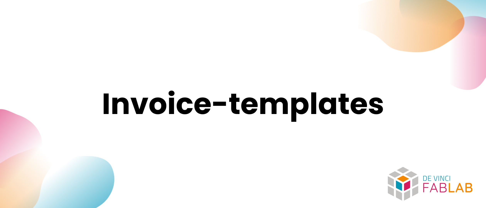

# FabStock

FabStock is a lightweight inventory tracking tool designed for makerspaces and fab labs, starting with 3D printing filament management and scalable to all types of consumables.

## Overview

> Simple inventory management for makerspaces and fab labs. Starts with 3D printing filament spools and scales up to any kind of consumable.

Planned key features:

- [ ] Spool inventory (material, color, diameter, remaining weight, cost, supplier, lot)
- [ ] Stock movements (inbound, outbound, adjustment) with history
- [ ] Low-stock alerts and restock recommendations
- [ ] Multi-location support (workshop, shelf, printer, cabinet)
- [ ] Labels/QR codes for quick identification
- [ ] CSV/JSON export and initial import
- [ ] Basic permissions (managers vs members)

## Getting Started

- [FabStock](#fabstock)
  - [Overview](#overview)
  - [Getting Started](#getting-started)
    - [Example](#example)
    - [How to use](#how-to-use)
      - [Prerequisites](#prerequisites)
      - [Installation](#installation)
      - [Editing](#editing)
    - [Supported languages](#supported-languages)
    - [Roadmap for future improvements](#roadmap-for-future-improvements)
    - [Contributing](#contributing)
    - [License](#license)

### Example

Here’s a preview (wireframe/mockup) of the future interface and core concepts:



### How to use

#### Prerequisites

- Git and a code editor like [Visual Studio Code](https://code.visualstudio.com/)
- No runtime dependencies yet (the project is in the design phase). Final technical choices will be documented here.

#### Installation

Clone the repository:

```bash
git clone https://github.com/DeVinci-FabLab/FabStock.git
```

#### Editing

- Open the project and check the `docs/` folder for product vision and assets.
- Specifications (data model, inventory flows, roles) will be added progressively under `docs/`.
- The first implementation (CLI/Web) will be announced here once ready, including detailed installation instructions.

### Supported languages

- English 🇬🇧 (docs & code)

### Roadmap for future improvements

- Phase 0 — Specifications and data model (spool, item, movement, location)
- Phase 1 — CLI prototype to create/list/move items
- Phase 2 — Lightweight Web UI (inventory, search, movements, alerts)
- Phase 3 — Labeling (QR codes) and mobile scanning
- Phase 4 — Exports/Imports, usage reports, thresholds and notifications

> [!NOTE]
> The project is being bootstrapped. Technical choices (stack, deployment) will be shared here with step-by-step guides.

### Contributing

Contributions are welcome! Open an issue to discuss a feature or a bug, or submit a pull request directly. A contribution guide will be added soon.

### License

This project is licensed under the MIT License — see [LICENSE](LICENSE).
